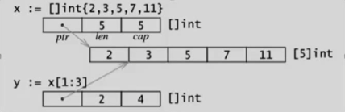
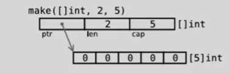
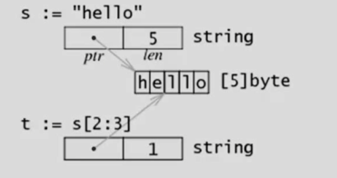

### 切片

1.  是一个数组的一个引用, 因此切片是引用类型

2. 长度可以改变, 切片是一个可变的数组

3. 遍历方式和数组一样, 可以用len()求长度

4. cap可以求出slice最大的容量, 0<=len(slice)<=cap(array),其中array是slice引用的数组

5. 定义:

   var 变量名 []类型 , 比如 var str []string, var arr []int

**切片初始化**: var slice []int = ar[start:end] 包含start到end之间的元素, 但不包含end

var slice []int = arr[0:end] 可以简写为: var slice []int = arr[:end]

var slice []int = arr[start:len(ar)] 可以简写为: var slice []int = arr[start:]

如果要切片最后一个元素去掉, 可以这么写: 

Slice = slice[:len(slice)-1]

```go
func main() {
	var slice []int
	var arr [5]int = [...]int{1, 2, 3, 4, 5}
	slice = arr[:]
	fmt.Println(slice)
	fmt.Println(len(slice)) //slice 的长度
	fmt.Println(cap(slice)) //slice的容量
	slice = slice[0:1]
	fmt.Println(len(slice)) //slice 的长度
	fmt.Println(cap(slice)) //slice的容量
}
```


切片的内存布局:



```go
type slice struct {
	ptr *[100]int
	len int
	cap int
}
func make1(s slice, cap int) slice{
	s.ptr = new([100]int)
	s.cap = cap
	s.len = 0
	return s
}
func testSlice2(){
	var s1 slice
	s1 = make1(s1, 10)
	s1.ptr[0] = 100
	modify(s1)

	fmt.Println(s1.ptr)
}

func modify(s slice) {
	s.ptr[1] = 1000
}
func main(){
	testSlice2()
}
```

运行结果:

```
&[100 1000 0 0 0 0 0 0 0 0 0 0 0 0 0 0 0 0 0 0 0 0 0 0 0 0 0 0 0 0 0 0 0 0 0 0 0 0 0 0 0 0 0 0 0 0 0 0 0 0 0 0 0 0 0 0 0 0 0 0 0 0 0 0 0 0 0 0 0 0 0 0 0 0 0 0 0 0 0 0 0 0 0 0 0 0 0 0 0 0 0 0 0 0 0 0 0 0 0 0]
```

```go
func main(){
	var a = [10]int{1,2,3,4}
	b := a[1:5]
	fmt.Printf("%p\n", b) 切片就是一个指针
	fmt.Printf("%p\n", &a[1])
}
```

运行结果:

```
0xc0420100f8
0xc0420100f8
```

##### 通过make来创建切片

1. `var slice []type = make([]type, len)`
2. `slice := make([]type, len)`
3. `slice := make([]type, len, cap)`




```go
func main() {
	var a [5]int =[...]int{1,23,4,5,6}
	s := a[1:]
	fmt.Printf("s=%p a[1]=%p\n", s, &a[1])
	s = append(s, 10)
	s = append(s, 10)
	s = append(s, 10)
	s = append(s, 10)
	s = append(s, 10)
	fmt.Println(s)
	fmt.Printf("s=%p a[1]=%p\n", s, &a[1])
}
```

运行结果:

```
s=0xc042070038 a[1]=0xc042070038
[23 4 5 6 10 10 10 10 10]
s=0xc042084000 a[1]=0xc042070038
```


当切片放不下的时候会另开辟一个内存空间 , 把原来的数组拷贝过去, 再追加数据


用append内置函数操作切片

`slice = append(slice, 10)`

```go
var a = []int{1,2,3}
var b = []int{4,5,6}
a = append(a,b...) //...可以直接展开切片b
```


##### 可以用for index, value := range slice{} 遍历切片


###### 切片resize

```go
var a = []int{1,3,4,5}
b:=a[1:2]
b = b[0:3]  切片可以再切片
```


###### 切片拷贝

```go
s1 :=[]int{1,2,3,4,5}
s2 :=make([]int, 10)
copy(s2, s1) //s1 拷到s2中
```

```go
func main(){
	var a []int = []int{1,2,3,4,5,6}
	b := make([]int, 10) // 如果容量为1 的话只会拷贝一个数据 不会自动扩容
	copy(b, a)
	fmt.Println(b)
}
```

运行结果:

```
[1 2 3 4 5 6 0 0 0 0]
```

b := make([]int, 10)时的运行结果:

```
[1]
```


###### string与slice

string底层就是一个byte的数组, 也可以进行切片操作

```go
s := "hello world"
	s1 := s[0:5]
	s2 := s[6:]
	fmt.Println(s1)
	fmt.Println(s2)
```

运行结果:

```
hello
world
```

###### string的底层布局

